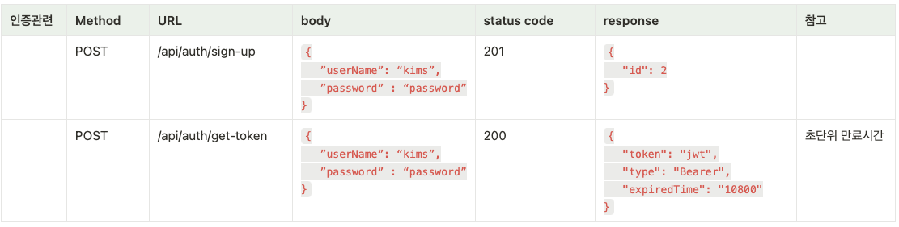
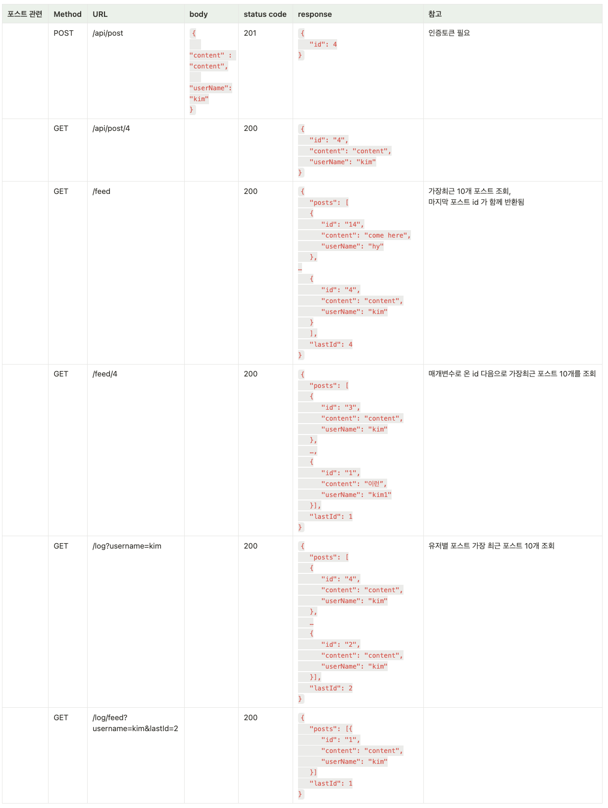

# 초패스트 php 포스팅 피드

**날짜 (11.08~11.23)**

### 선행

**PHP 학습**

step 1 기본 문법

step 2 http 통신방법

step 3 rest api 통신방법

step 4 phpUnit 유닛 테스트 방법

## 게시판 구현
## stack ##
- php 8.2
- laravel 10.10
- firebase jwt

**컴포즈 글로벌(전역) 설치**

```bash
curl -sS [https://getcomposer.org/installer](https://getcomposer.org/installer) | php
sudo mv composer.phar /usr/local/bin/composer  #이동시 전역으로 사용가능
```

**컴포즈(Compose) 로 라라벨 프로젝트 생성**

```bash
composer create-project --prefer-dist laravel/laravel {프로젝트명}
```

**라라벨 실행**

```bash
./php artisan serve
```

기본적인 설정파일은 `/config/app.php` 에 위치하지만 컴포즈로 생성한 프로젝트는 최상단에 위치한`.env` 파일을 우선적으로 적용, 만약에 설정이 존재하지 않으면 `app.php` 를 후순위로 반영한다.

**라라벨 http 요청 흐름**

`http kernel` →`route` → `middleware` →  `controller` → `response`

**App 디렉토리**

app 일은이 디렉토리는 [PSR-4 오토로딩 표준](https://www.php-fig.org/psr/psr-4/)를 사용하는 컴포저에 의해서 `App` **이라는 네임스페이스를 통해서 오토로딩됨**

**ServiceProvider 관리위치**

`config/app.php`  `providers` 배열에서 관리

**Request 파사드에서 json body 추출**

`$name = $request->input('user.name');`


# API #
- 인증
- 
* 포스트
- 
